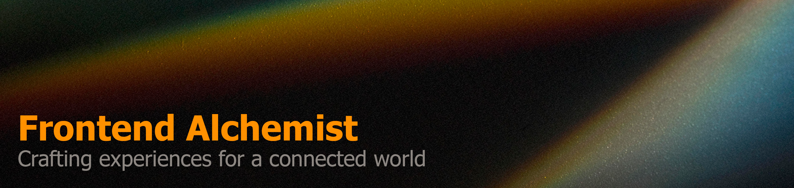

  
  &nbsp;
  
  &nbsp;
  

<h3>Things I code with</h3>

  
    
  
   
  
  

  
  
  
    
   
  
  
    
   
  
  
  

👉 Just visit my **[<a href="https://leomonzon.vercel.app/" target="_blank" rel="noreferrer" >portfolio</a>](#)**

  🌎 La Plata - Posadas, Argentina, and Coronel Bogado, Paraguay. I frequently move between these locations.
